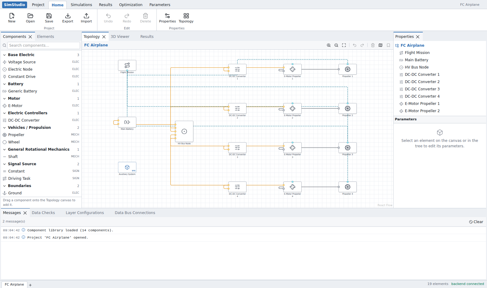
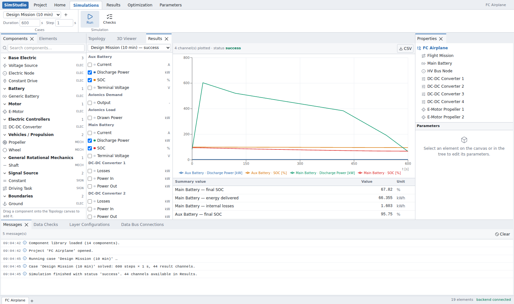
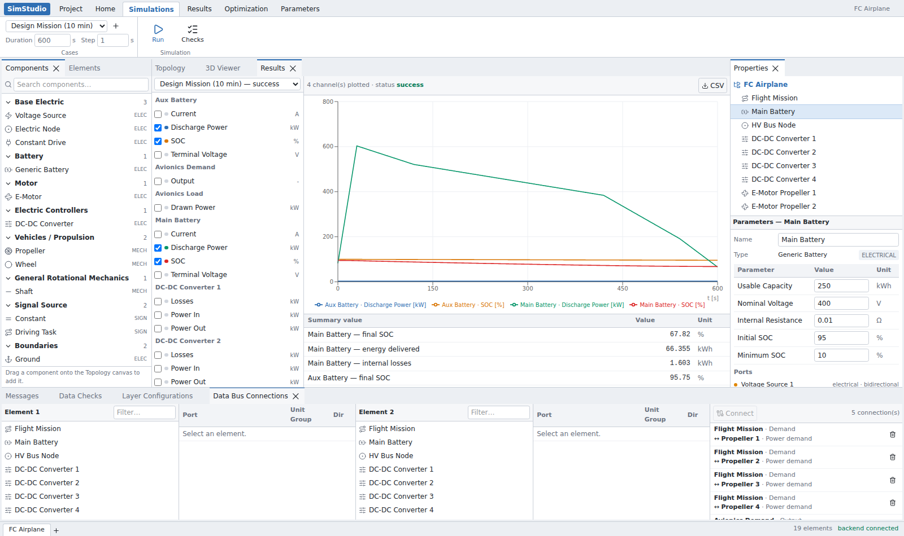

# SimStudio — CRUISE M-style System Simulation Tool

A web-based vehicle system simulation tool modeled on AVL CRUISE M's
workflow: build a system topology from a component library, wire elements
together (including signal / data-bus connections), run a dynamic
simulation, watch it live, and inspect results — all inside a
desktop-grade, dockable-panel UI.



## Features (v2)

| Area | What works |
|---|---|
| **Topology builder** | Drag components from the searchable library tree onto a React Flow canvas, connect ports (kind-checked), pan/zoom, multi-select, delete, undo/redo (Ctrl+Z / Ctrl+Y), minimap toggle |
| **Component library** | Declarative catalog in `backend/app/library/components.json` with mandatory units on every parameter (dimensionless = `-`) and first-class lookup tables (`table1d` / `table2d`, dict-keyed by the independent variable) |
| **Dynamic solver** | Causal multi-pass solver with real states: vehicle speed integrates from net tire force, per-wheel speeds with a longitudinal slip tire model, battery SOC from an equivalent-circuit model, semi-implicit Euler with internal sub-stepping (case `timeStep` is only the recording interval) |
| **Differential** | Locked/unlocked with genuinely different dynamics: unlocked = equal torque split with free output speeds (one wheel on ice spins up), locked = common speed with grip-dependent emergent torque split |
| **Driver** | Separate Driver component (speed-following PI): wire a target-speed profile and the Vehicle's speed into it; braking blends recuperation (motor generator quadrant, battery charge limit) before friction brakes |
| **Live simulation** | Runs stream over a WebSocket: progress + all channels update live, the solver can be paced against real time (Pacing selector), cancelled, and scalar parameters (e.g. driver PI gains) can be edited mid-run from the Properties panel |
| **Monitors** | Display-only Monitor component: add named signal inputs, wire anything into them, get live readout cards + sparklines in the Monitors panel |
| **Scripting** | Script (Function) component: user-written Python `step(t, dt, inputs, state, params)` with named per-instance ports — for hybrid control strategies, custom recuperation logic, signal math |
| **Maps** | E-Motor with voltage-dependent full-load torque map, power-loss map, drag torque; battery OCV(SOC) table — all edited in table grids in the Properties panel |
| **Data Checks** | Pre-run validation: reference integrity, port-kind mismatches, parameter ranges, table data, script compilation, driveline solvability (delegated to the solver's model extraction) |
| **Results** | Channel picker (grouped per element), multi-channel time-series chart that fills in live during the run, summary table (SOC, energy, recuperation, distance, consumption), CSV export |
| **Persistence** | Save/load projects on the backend (single JSON file per project), plus browser Export / Import |
| **UI shell** | Ribbon (Project / Home / Simulations / Results + visual stubs), dockable & resizable panels (Dockview), status bar with live progress |




## Quickstart

Two processes: a FastAPI backend (solver, validation, library, persistence)
and a Vite dev server (UI). The Vite server proxies `/api` (HTTP and
WebSocket) to the backend.

```bash
# 1. backend  (Python ≥ 3.11)
cd backend
pip install -r requirements.txt
python -m uvicorn app.main:app --reload --port 8000

# 2. frontend (Node ≥ 20)
cd frontend
npm install
npm run dev            # → http://localhost:5173
```

The demo project **Battery Electric Car** loads automatically: HV Battery
Pack → HV Bus → (Power Consumer, E-Motor) → Final Drive → Differential →
Node FL/FR → Brake + Wheel per corner (rear corners unpowered), with a
Vehicle body, a Driver element, a target-speed Vehicle Task, and
Vehicle/BMS monitors. A **P2 Hybrid Car** example (engine, clutch,
gearbox, HCU script) is available via Open. Open the **Simulations** ribbon tab and press **Run** — pick the
*City Cycle (live, 10×)* case to watch it stream in real time and tune
parameters (try the driver gains on the Vehicle, or lock the Differential)
while it runs.

If the backend is not running the UI still works from bundled data
(topology editing only); save / checks / simulation are disabled and a
warning appears in Messages.

### Tests

```bash
cd backend
pip install -r requirements-dev.txt
python -m pytest tests/     # maps, dynamics, differential modes, scripts, API + WS
cd frontend
npm run build               # type-check + production build
```

## Architecture

```
frontend/  React 19 + TypeScript + Vite
  ├─ Dockview        dockable panel shell (library / canvas / properties / bottom tabs)
  ├─ React Flow      topology canvas with custom element nodes & kind-colored edges
  ├─ Zustand         project graph, selection, undo history, live run state, results
  ├─ Recharts        results time-series charts (live-updating)
  └─ Tailwind CSS    dense engineering-tool styling

backend/   Python + FastAPI
  ├─ app/library/components.json   declarative component catalog (ports, params, maps)
  ├─ app/schemas.py                pydantic models mirroring the shared JSON data model
  ├─ app/solver/                   causal multi-pass solver package
  │    ├─ maps.py                  shared table parsing + 1D/2D interpolation
  │    ├─ profiles.py              driving-task profile parsing
  │    ├─ network.py               model extraction: rigid segments, buses, signal routes
  │    ├─ scripting.py             Script component compile/run
  │    └─ core.py                  stepping loop: driver → mechanics → tire/vehicle → electrical
  ├─ app/validation.py             "Data Checks" pre-run validation
  ├─ app/storage.py                one JSON file per project
  └─ projects/bev-car.json         demo project
```

### API

| Method & path | Purpose |
|---|---|
| `GET /api/library` | Component definitions |
| `GET /api/projects` | List saved projects |
| `GET/PUT/DELETE /api/projects/{id}` | Load / save / delete a project |
| `POST /api/validate` | Run Data Checks on a project payload |
| `POST /api/simulate` | Validate + solve one case synchronously |
| `WS /api/simulate/run` | Live run: client sends `start`, then optional `set_param` / `cancel`; server streams `step` / `message` events and a final `done` with the full result |

## Data model

A project is a single JSON document (see `backend/projects/bev-car.json`):
`Project → SystemNode[] (hierarchical) → ElementInstance[] + Connection[]`,
plus project-level `DataBusConnection[]` and `SimCase[]`. Component types are
referenced by id and resolved against the library, so parameters live as
sparse overrides on the instance. Table parameters are dicts keyed by the
independent variable (`{"1500": 345.6, …}`; 2D maps nest one level, e.g.
voltage → speed → torque). Elements of components with `allowDynamicPorts`
(Script, Monitor) carry per-instance named signal ports in `dynamicPorts`.

## Solver

Each recorded step evaluates signal sources and Script blocks (topological
order over the signal graph, one-step delay on loops), then runs internal
sub-steps (≤ 10 ms, semi-implicit Euler):

1. **Driver** — PI on target vs. actual speed → traction command ∈ [−1, 1]
   and brake command, with capability-aware regen blending (motor Q4 map ×
   recuperation weight, battery max charge power, fade-out near standstill).
2. **Mechanics** — motor torque from the voltage-dependent full-load map,
   reflected through the gear chain (direction-aware efficiencies) into the
   differential; per-segment equations of motion (2×2 coupled mass matrix
   for an open diff, merged inertia when locked); brakes with proper
   static-friction standstill hold; tire slip term integrated implicitly
   (it is numerically stiff at low speed).
3. **Vehicle** — net tire force − aero − rolling − grade integrates speed
   and distance.
4. **Electrical** — motor electrical power = mechanical + loss map; buses
   solved in dependency order (DC-DC bridges); battery equivalent circuit
   (OCV(SOC) table, R0, optional RC pair) solved closed-form per sub-step;
   SOC integrates; the terminal voltage feeds next step's motor map.

Live `set_param` messages apply at recording-step boundaries; structural
parameters (ratios, inertias, code, table axes) take effect on the next run
and say so in Messages.

## Known limitations

- One differential and one E-Motor per driveline subgraph (multiple
  independent drivelines — e.g. dual-motor AWD as two axles — work).
- One battery or voltage source per electrical bus; DC-DC is unidirectional.
- Forward driving only (no reverse), no thermal/fluid solving.
- Sub-system containers are organizational: physical connections cannot cross
  a container boundary (signals can, via the Data Bus).
- The bookmark tool and Optimization/Parameters ribbon tabs are visual stubs.
